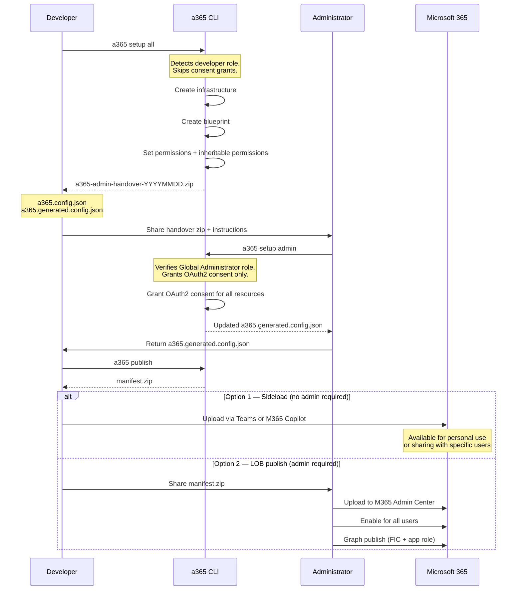
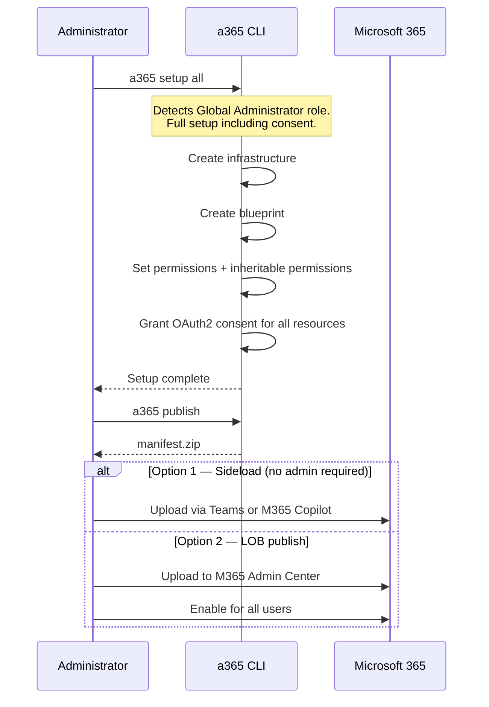

# Developer-Admin Separation for a365 CLI

**Issue:** [#143](https://github.com/microsoft/Agent365-devTools/issues/143)
**Priority:** P1 — Security / Role Enforcement
**Status:** Design Review

---

## Problem

The `a365` CLI today requires a single user to hold all roles: Azure Subscription Contributor, Agent ID Developer, and Global Administrator. In most enterprise environments these roles are held by different people. When a developer runs `a365 setup all`, the command fails mid-flight on admin-only steps with no actionable guidance on what to hand over or what to expect back.

---

## Roles and Responsibilities

| Operation | Who | Command(s) |
|-----------|-----|------------|
| Azure infrastructure (resource group, app service, MSI) | Developer (Azure Subscription Contributor) | `a365 setup all`, `a365 setup infrastructure` |
| Agent blueprint creation | Developer (Agent ID Developer) | `a365 setup all`, `a365 setup blueprint` |
| Permission declarations and inheritable permissions | Developer (Agent ID Developer) | `a365 setup all`, `a365 setup permissions mcp/bot/custom/copilotstudio`, `a365 setup blueprint` |
| OAuth2 consent grants | **Global Administrator only** | `a365 setup admin`, `a365 setup permissions mcp/bot/custom/copilotstudio` (admin mode), `a365 setup blueprint` (admin mode) |
| Sideload agent for personal use or sharing with specific users | Developer (self-service) | `a365 publish` (Option 1) |
| Upload agent to Microsoft 365 Admin Center (LOB scope) | **Global Administrator only** | `a365 publish` (Option 2 — manual step, no CLI automation) |
| Enable agent for all users | **Global Administrator only** | Manual — Microsoft 365 Admin Center |

The sole admin gate in setup is **OAuth2 consent grants**. All other operations are developer-permitted.

---

## Solution

`setup all` uses **implicit role detection** — it detects whether the caller is a Global Administrator and behaves accordingly. `setup admin` is a dedicated consent-only command for the handover scenario where admin and developer are different people.

| Command | Who runs it | What it does |
|---------|-------------|--------------|
| `a365 setup all` | Developer | All setup steps except OAuth2 consent. Produces a handover package for the admin. |
| `a365 setup all` | Global Administrator | All setup steps **including** OAuth2 consent. No handover needed — done in one shot. |
| `a365 setup admin` | Global Administrator | OAuth2 consent grants only. Used in the handover scenario — admin does not need to re-run infra or blueprint. Fails immediately if caller is not a Global Administrator. |

No flags, no switches. Mode is always detected implicitly from the caller's role.

For recovery scenarios, all standalone permission subcommands (`setup permissions mcp/bot/custom/copilotstudio`, `setup blueprint`) also detect the caller's role implicitly and behave accordingly — developers set permissions and inheritance, admins additionally grant consent.

---

## End-to-End User Experience

### Path A — Developer and Administrator are different people

#### Step 1: Developer sets up infrastructure and blueprint

```
> a365 setup all

Running in developer mode. Consent grants require a Global Administrator and will be skipped.

Step 1: Creating Azure infrastructure...           [OK]
Step 2: Creating agent blueprint...                [OK]
Step 3: Configuring permissions and inheritance... [OK]

==========================================
Admin Handover
==========================================
Developer setup complete. OAuth2 consent grants require a Global Administrator.

Handover package: a365-admin-handover-20260312.zip
  Contains: a365.config.json, a365.generated.config.json

Administrator instructions:
  1. Install the CLI:
       dotnet tool install -g Microsoft.Agents.A365.DevTools.Cli --prerelease
  2. Extract the handover package to a working directory
  3. Run: a365 setup admin
  4. Return the updated a365.generated.config.json to the developer

Pending (consent required):
  - Agent 365 Tools (MCP)
  - Messaging Bot API
  - Observability API
  - Power Platform API

After admin returns the config file, continue with:
  a365 publish
==========================================
```

Developer shares the zip with the administrator. No source code or project folder required.

---

#### Step 2: Administrator grants consent (handover scenario)

The admin installs the CLI, extracts the zip, and runs the dedicated admin command:

```
> a365 setup admin

Verifying Global Administrator role...             [OK]

Granting OAuth2 consent...
  - Agent 365 Tools (MCP)...                       [OK]
  - Messaging Bot API...                           [OK]
  - Observability API...                           [OK]
  - Power Platform API...                          [OK]

==========================================
Administrator tasks complete.

Return the following file to the developer:
  a365.generated.config.json

Developer can now continue with:
  a365 publish
==========================================
```

Admin returns `a365.generated.config.json` to the developer.

If the caller is not a Global Administrator, the command fails immediately:

```
> a365 setup admin

Error: Global Administrator role required.
Verify your role at: https://portal.azure.com/#view/Microsoft_AAD_IAM/ActiveDirectoryMenuBlade/~/RolesAndAdministrators
```

---

### Path B — Administrator runs setup directly (single-person setup)

When a Global Administrator runs `setup all`, role detection fires automatically and the full setup — including OAuth2 consent — completes in one shot. No handover needed.

```
> a365 setup all

Running in administrator mode. Consent grants will be applied.

Step 1: Creating Azure infrastructure...           [OK]
Step 2: Creating agent blueprint...                [OK]
Step 3: Configuring permissions, inheritance, and consent...
  - Agent 365 Tools (MCP)...                       [OK]
  - Messaging Bot API...                           [OK]
  - Observability API...                           [OK]
  - Power Platform API...                          [OK]

==========================================
Setup complete.

Continue with:
  a365 publish
==========================================
```

---

### Developer (publishes)

Developer places the returned config file and runs:

```
> a365 publish

Manifest updated. Package created: manifest/manifest.zip

Developer tasks complete:
  - Manifest updated with Blueprint ID
  - Package ready: manifest.zip

Next steps — choose your publish scope:

Option 1: Sideload (no admin required)
  Upload directly for personal testing or to share with specific users.
  Teams > Apps > Manage your apps > Upload an app
  File: manifest/manifest.zip
  Reference: https://learn.microsoft.com/microsoftteams/platform/concepts/deploy-and-publish/apps-upload

Option 2: Publish to organization — LOB scope (Global Administrator required)
  Share this package with your administrator:
    File: manifest/manifest.zip
    1. Upload to Microsoft 365 Admin Center:
         https://admin.microsoft.com > Agents > All agents > Upload custom agent
    2. Enable for all users:
         Open the uploaded agent > Settings > enable "Allow all users"
    3. Publish to Microsoft Graph:
         Contact your administrator for FIC and app role configuration
```

---

## Round-Trip Summary

### Path A — Developer and Administrator are different people



### Path B — Administrator runs setup directly



---

## Scope of CLI Changes

| Command | Who | What changes |
|---------|-----|--------------|
| `setup all` | Developer | Detects developer role; skips consent; produces handover zip pointing to `setup admin` |
| `setup all` | Global Administrator | Detects admin role; runs full setup including consent; no handover needed |
| `setup admin` | Global Administrator | **New command** — consent grants only; for handover scenario; fails early if not Global Admin |
| `setup blueprint` | Developer / Admin | Implicit mode detection — developer sets permissions, admin also grants Graph consent |
| `setup blueprint --endpoint-only` | Developer / Admin | Attempts endpoint; prints handover if permission denied |
| `setup permissions mcp` | Developer / Admin | Implicit mode detection |
| `setup permissions bot` | Developer / Admin | Implicit mode detection |
| `setup permissions custom` | Developer / Admin | Implicit mode detection; developer incremental re-run path unchanged |
| `setup permissions copilotstudio` | Developer / Admin | Implicit mode detection |
| `publish` | Developer | Two-path output: sideload (self-service) + LOB (admin handover) |

All commands are idempotent.

---

## What Is Not Changing

- No new flags or switches on existing commands
- No project source files are required on the admin machine
- The developer workflow for incremental permission updates (`a365 setup permissions custom`) is unchanged
- The `a365 publish` admin steps (M365 upload, MOS Titles) remain manual — this change adds clear instructions, not automation

---

## Key Design Decisions

| Decision | Rationale |
|----------|-----------|
| `setup admin` as a dedicated command | Consent-only scope for the handover scenario; admin needs no Azure access, no infra re-run; unambiguous instruction; fails fast if role missing |
| `setup all` with implicit role detection | Global Admin gets full setup in one shot; developer gets guided handover; same command, no flags |
| Handover as a zip file | Self-contained; no repo access required; easy to share via email or Teams |
| Admin returns only `a365.generated.config.json` | Minimal surface area; developer already has everything else |
| Implicit mode on standalone subcommands | Recovery scenarios; developer and admin run same command |
| Single admin-only operation (OAuth2 consent) | Scope is contained; no architectural overhaul required |
