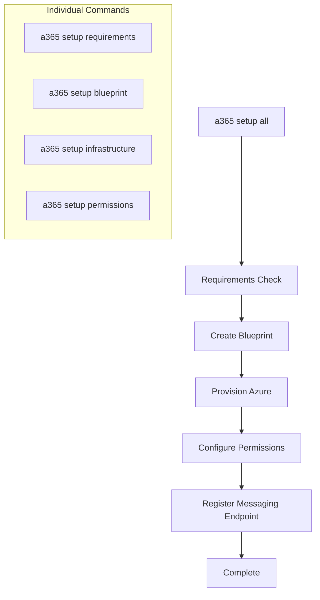

# SetupSubcommands

This folder contains the workflow components for the `a365 setup` command. The setup process is divided into discrete subcommands that can run independently or as part of the full workflow.

> **Parent:** [Commands](../README.md) | **CLI Design:** [design.md](../../design.md)

---

## Component Reference

| Component | File | Description |
|-----------|------|-------------|
| **AllSubcommand** | `AllSubcommand.cs` | Orchestrates the complete setup workflow (`a365 setup all`) |
| **BlueprintSubcommand** | `BlueprintSubcommand.cs` | Creates agent blueprint application registration |
| **BlueprintCreationOptions** | `BlueprintCreationOptions.cs` | Options record for blueprint creation (e.g. `DeferConsent`) |
| **InfrastructureSubcommand** | `InfrastructureSubcommand.cs` | Provisions Azure infrastructure (App Service, etc.) |
| **PermissionsSubcommand** | `PermissionsSubcommand.cs` | Configures Graph API permissions and admin consent |
| **BatchPermissionsOrchestrator** | `BatchPermissionsOrchestrator.cs` | Three-phase batch permissions flow used by `setup all` and standalone permission commands |
| **ResourcePermissionSpec** | `ResourcePermissionSpec.cs` | Spec record describing a single resource's required permissions |
| **RequirementsSubcommand** | `RequirementsSubcommand.cs` | Validates prerequisites (Azure CLI, permissions) |
| **SetupHelpers** | `SetupHelpers.cs` | Shared helper methods; `EnsureResourcePermissionsAsync` used by standalone callers and `CopilotStudioSubcommand` |
| **SetupResults** | `SetupResults.cs` | Result models for setup operations |
| **SetupContext** | `SetupContext.cs` | Context bundle threaded through orchestrator steps; exposes `AuthMode`, `IsOboMode`, `IsS2sMode`, `IsBothMode` |
| **NonDwBlueprintSetupOrchestrator** | `NonDwBlueprintSetupOrchestrator.cs` | Blueprint-based non-DW setup flow; stamps inheritable permissions + S2S grants on the blueprint, then gates agent identity grants by `authMode` (skipping the per-identity S2S grant when the role is already inherited) |

---

## Setup Workflow



### Workflow Steps

1. **Requirements** - Validate Azure CLI authentication, subscription access, required permissions
2. **Blueprint** - Create Entra ID application registration for the agent blueprint
3. **Infrastructure** - Provision Azure App Service, configure app settings
4. **Permissions** - Configure Microsoft Graph API permissions, grant admin consent
5. **Messaging Endpoint (M365 only, opt-in)** - For M365 agents, register the blueprint's backend messaging endpoint via the Teams Graph API (routed through MCP Platform). Requires `--m365`; other hosts configure the endpoint directly in the Teams Developer Portal.

---

## Usage

```bash
# Run complete setup
a365 setup all

# Run individual steps
a365 setup requirements    # Check prerequisites only
a365 setup blueprint       # Create blueprint only
a365 setup infrastructure  # Provision Azure only
a365 setup permissions     # Configure permissions only
```

### Authentication mode (`--authmode`)

The `--authmode` option controls how the agent identity service principal is granted permissions. It is available on `setup all` only.

| Value | Behaviour |
|-------|-----------|
| `obo` (default) | Principal-scoped delegated grants (`consentType: "Principal"`) on the agent identity SP — no Global Admin required |
| `s2s` | Application role assignments — when the blueprint already holds the roles and inheritable permissions are configured (`allAllowed`), the agent identity inherits them and no direct grant is made; otherwise the grant is attempted on the agent identity SP programmatically, then via `az rest`, with PowerShell instructions printed only if both fail |
| `both` | Both OBO delegated grants and S2S app role assignments |

`authMode` may also be persisted in `a365.config.json` so it takes effect on every run without the flag.

Non-DW agents stamp the same permission spec set on the blueprint (inheritable permissions with `kind=allAllowed`, plus S2S app-role grants on the blueprint SP when the caller is a Global Admin). Because inheritance covers both scopes and roles, the agent identity inherits the blueprint's grants automatically — so the per-identity S2S grant (issue #460) is skipped when the blueprint grant and inheritance both succeeded, and the delegated (OBO) path never issues a per-identity grant at all.

```bash
# Use OBO grants (default)
a365 setup all

# Use S2S app-role assignments
a365 setup all --authmode s2s

# Use both
a365 setup all --authmode both
```

---

### Messaging endpoint (M365 agents)

The `--m365` flag opts into registering the messaging endpoint with Teams Graph via MCP Platform. On `setup all` it is **off by default** — without it, the messaging-endpoint step is skipped and you're pointed at the Teams Developer Portal for manual configuration. The `--endpoint-only` and `--update-endpoint` operations always use the Teams Graph path, so `--m365` is inferred there and doesn't need to be passed.

```bash
# Full setup including messaging endpoint registration
a365 setup all --m365

# Register the messaging endpoint only (existing blueprint; --m365 is inferred)
a365 setup blueprint --endpoint-only

# Update the endpoint URL (clears and re-registers)
a365 setup blueprint --update-endpoint https://your-host.example.com/api/messages
```

If the tenant's Teams Graph backend can't service the request, the CLI logs a contract-mismatch notice and points to the Teams Developer Portal for manual configuration.

When the server rejects the request with a recognized contract-mismatch signature (today: the pre-migration Azure Bot Service validator), the CLI logs at INFO:

```
Automated messaging endpoint registration is not available for this tenant yet. You'll need to configure it manually.
```

and the `a365 setup all` summary includes an "Action Required" entry with the Teams Developer Portal URL. The command does not fail — other setup steps still complete.

---

## BatchPermissionsOrchestrator

`BatchPermissionsOrchestrator.cs` implements a three-phase batch permissions flow used by `setup all` and the standalone `setup permissions` subcommands:

- **Phase 1 — Resolve service principals** (non-admin): Pre-warms the delegated token and resolves all SP IDs once. `requiredResourceAccess` is not updated here — it is not supported for Agent Blueprints.
- **Phase 2 — Configure inherited permissions** (Agent ID Administrator or Global Administrator): Creates OAuth2 grants and sets inheritable permissions using IDs from Phase 1. A 403 response is caught silently and treated as insufficient role — one consolidated warning is emitted without additional API calls.
- **Phase 3 — Grant admin consent** (Global Administrator only, or URL for non-admins): Checks for existing consent before opening a browser. Returns a consolidated URL when the user lacks the Global Administrator role.

`CopilotStudioSubcommand` is out of scope and continues to call `EnsureResourcePermissionsAsync` directly.

## SetupHelpers

The `SetupHelpers.cs` file contains shared functionality:

- **EnsureResourcePermissionsAsync** - Configures permissions for a single resource with retry logic; used by standalone `CopilotStudioSubcommand` and direct callers
- **WaitForPermissionPropagationAsync** - Waits for Entra ID permission propagation
- **ValidateConfigurationAsync** - Validates configuration before setup operations

---

## Cross-References

- **[Commands/](../README.md)** - Parent commands folder
- **[Services/](../../Services/README.md)** - Business logic services used by setup
- **[CLI Design](../../design.md)** - Permissions architecture details
